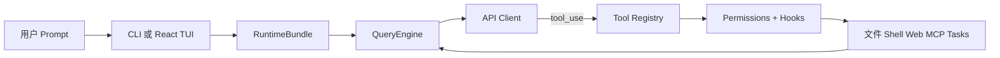

<h1 align="center">
  
  &nbsp;&nbsp;
  
  <br>
  <code>oh</code> — OpenHarness &amp; <code>ohmo</code>
</h1>

<p align="center">
  <a href="README.md"><strong>English</strong></a> ·
  <a href="README.zh-CN.md"><strong>简体中文</strong></a>
</p>

**OpenHarness** 提供轻量级 Agent 核心基础设施：工具调用、技能系统、记忆系统和多智能体协调。

**ohmo** 是基于 OpenHarness 构建的个人 AI 助手 — 不是聊天机器人，而是能在长会话中真正为你工作的助手。通过飞书 / Slack / Telegram / Discord 与 ohmo 对话，它能自主 fork 分支、写代码、跑测试、提 PR。ohmo 运行在你现有的 Claude Code 或 Codex 订阅上 — 无需额外 API key。

**加入社区**：一起贡献 **Harness** 开放 Agent 开发。

<p align="center">
  <a href="#-快速开始"></a>
  <a href="#-harness-架构"></a>
  <a href="#-核心能力"></a>
  <a href="#-测试结果"></a>
  <a href="LICENSE"></a>
</p>

<p align="center">
  
  
  
  
  
  <a href="https://github.com/HKUDS/OpenHarness/actions/workflows/ci.yml"></a>
</p>

一条命令 (**oh**) 启动 **OpenHarness**，解锁全部 Agent Harness 能力。

---

## ✨ 核心 Harness 能力

<table align="center" width="100%">
<tr>
<td width="20%" align="center" style="vertical-align: top; padding: 15px;">

<h3>🔄 Agent Loop</h3>

<p align="center"><strong>• Streaming Tool-Call 循环</strong></p>
<p align="center"><strong>• 指数退避 API 重试</strong></p>
<p align="center"><strong>• 并行工具执行</strong></p>
<p align="center"><strong>• Token 计数与成本追踪</strong></p>

</td>
<td width="20%" align="center" style="vertical-align: top; padding: 15px;">

<h3>🔧 Harness 工具集</h3>

<p align="center"><strong>• 42+ 工具 (文件、Shell、搜索、Web、Git、MCP)</strong></p>
<p align="center"><strong>• 按需加载 Skill (.md)</strong></p>
<p align="center"><strong>• 插件生态 (Skills + Hooks + Agents)</strong></p>
<p align="center"><strong>• 兼容 anthropics/skills & plugins</strong></p>

</td>
<td width="20%" align="center" style="vertical-align: top; padding: 15px;">

<h3>🧠 上下文与记忆</h3>

<p align="center"><strong>• CLAUDE.md 发现与注入</strong></p>
<p align="center"><strong>• 上下文压缩 (Auto-Compact)</strong></p>
<p align="center"><strong>• MEMORY.md 持久记忆</strong></p>
<p align="center"><strong>• 会话恢复与历史</strong></p>

</td>
<td width="20%" align="center" style="vertical-align: top; padding: 15px;">

<h3>🛡️ 治理</h3>

<p align="center"><strong>• 多级权限模式</strong></p>
<p align="center"><strong>• 路径与命令规则</strong></p>
<p align="center"><strong>• PreToolUse / PostToolUse 钩子</strong></p>
<p align="center"><strong>• 交互式审批对话框</strong></p>

</td>
<td width="20%" align="center" style="vertical-align: top; padding: 15px;">

<h3>🤝 Swarm 协调</h3>

<p align="center"><strong>• 子代理孵化与委派</strong></p>
<p align="center"><strong>• Team 注册与任务管理</strong></p>
<p align="center"><strong>• 后台任务生命周期</strong></p>
<p align="center"><strong>• <a href="https://github.com/HKUDS/ClawTeam">ClawTeam</a> 集成 (路线图)</strong></p>

</td>
</tr>
</table>

---

## 🤔 什么是 Agent Harness?

**Agent Harness** 是包裹 LLM 使其成为可用 Agent 的完整基础设施。模型提供智能；Harness 提供**手、眼、记忆和安全边界**。

OpenHarness 是面向**研究者、构建者和社区**的开源 Python 实现：

- **理解** 生产级 AI Agent 底层如何运作
- **实验** 前沿的工具、技能和智能体协调模式
- **扩展** 自定义插件、Provider 和领域知识
- **构建** 基于成熟架构的专用智能体

---

## 📰 最新动态

- **Unreleased** 🔍 **Dry-run 安全预览**：`oh --dry-run` 预览运行时配置、认证状态、技能、命令、工具和 MCP 服务器，不执行模型或工具。
- **Unreleased** 🌐 **Google Gemini & DeepSeek 一等公民**：内置 `gemini` 和 `deepseek` Provider profile，支持原生 API key 认证。
- **Unreleased** 📝 **solo & wolo 独立应用**：`solo`（个人日志）和 `wolo`（工作日志）作为独立 app 运行，有自己的 workspace、CLI、gateway 和工具。
- **Unreleased** 🖥️ **TUI 改进**：并行工具调用树形连接器、平滑滚动、备用屏幕缓冲区、紧凑状态栏。
- **Unreleased** 🔧 **工具整合**：`SkillManagerTool` 和 `CronManagerTool` 整合为单一子命令工具；新增 `diff`、`git`、`todo` 工具。
- **2026-04-10** 🧠 **v0.1.6** — Auto-Compaction，多日会话不再需要手动 compact。
- **2026-04-08** 🔌 **v0.1.5** — MCP HTTP transport，子进程 Agent 可轮询。
- **2026-04-08** 🌙 **v0.1.4** — 多 Provider 认证 & Moonshot/Kimi。
- **2026-04-06** 🚀 **v0.1.2** — 统一 setup 流程 & `ohmo` personal-agent app。
- **2026-04-01** 🎨 **v0.1.0** — OpenHarness 首次开源发布。

<p align="center">
  <strong>快速入口：</strong>
  <a href="#-快速开始">快速开始</a> ·
  <a href="#-provider-兼容性">Provider 兼容性</a> ·
  <a href="docs/SHOWCASE.md">Showcase</a> ·
  <a href="CONTRIBUTING.md">贡献指南</a> ·
  <a href="CHANGELOG.md">更新日志</a>
</p>

---

## 🚀 快速开始

### 1. 安装

#### Linux / macOS / WSL

```bash
# 一键安装
curl -fsSL https://raw.githubusercontent.com/HKUDS/OpenHarness/main/scripts/install.sh | bash

# 或 pip 安装
pip install openharness-ai
```

#### Windows (原生)

```powershell
# PowerShell 一键安装
iex (Invoke-WebRequest -Uri 'https://raw.githubusercontent.com/HKUDS/OpenHarness/main/scripts/install.ps1')

# 或 pip 安装
pip install openharness-ai
```

**注意**：Windows 已原生支持。在 PowerShell 中请使用 `openh` 代替 `oh`（`oh` 会解析为内置 `Out-Host` 别名）。

### 2. 配置

```bash
oh setup    # 交互式向导 — 选择 provider、认证、完成
```

支持 **Claude / OpenAI / Copilot / Codex / Moonshot(Kimi) / GLM / MiniMax / Gemini / DeepSeek / Qwen** 及任何兼容接口。

### 3. 运行

```bash
oh
```

### 4. 配置 ohmo（个人助手）

想要一个从飞书 / Slack / Telegram / Discord 为你工作的 AI Agent？

```bash
ohmo init             # 初始化 ~/.ohmo 工作区
ohmo config           # 配置 channel 和 provider
ohmo gateway start    # 启动 gateway — ohmo 上线
```

ohmo 运行在你现有的 **Claude Code 订阅**或 **Codex 订阅**上 — 无需额外 API key。

### 5. 配置 solo / wolo（日志助手）

```bash
# solo — 个人生活日志
solo init && solo config && solo gateway start

# wolo — 工作日志
wolo init && wolo config && wolo gateway start
```

### 非交互模式（管道与脚本）

```bash
oh -p "Explain this codebase"
oh -p "List all functions in main.py" --output-format json
oh -p "Fix the bug" --output-format stream-json
```

### Dry Run（安全预览）

```bash
oh --dry-run                    # 预览交互会话配置
oh --dry-run -p "Review code"   # 预览 prompt 不执行
oh --dry-run -p "/plugin list"  # 预览 slash command
```

Dry-run 是静态检查：

- **不**调用模型、执行工具、启动子代理、连接 MCP
- **会**解析 settings、auth、prompt、skills、commands、tools 和 MCP 配置

就绪度级别：`ready`（可直接运行）/ `warning`（有问题需处理）/ `blocked`（无法运行）

---

## 🔌 Provider 兼容性

OpenHarness 将 provider 视为 **workflow + profile**。日常推荐：

```bash
oh setup
oh provider list
oh provider use <profile>
```

### 内置 Workflow

| Workflow | 说明 | 典型后端 |
|----------|------|----------|
| **Anthropic-Compatible API** | Anthropic 风格请求格式 | Claude 官方、Kimi、GLM、MiniMax |
| **Claude Subscription** | Claude CLI 订阅桥接 | 本地 `~/.claude/.credentials.json` |
| **OpenAI-Compatible API** | OpenAI 风格请求格式 | OpenAI、OpenRouter、DashScope、SiliconFlow、Groq、Ollama |
| **DeepSeek API** | 原生 DeepSeek API key | `deepseek-chat`、`deepseek-reasoner` |
| **Google Gemini** | 原生 Gemini API key | `gemini-2.5-flash`、`gemini-2.5-pro` |
| **Codex Subscription** | Codex CLI 订阅桥接 | 本地 `~/.codex/auth.json` |
| **GitHub Copilot** | Copilot OAuth 流程 | GitHub Copilot device-flow 登录 |

### 兼容 API 列表

#### Anthropic-Compatible API

| 后端 | Base URL | 示例模型 |
|------|----------|----------|
| **Claude 官方** | `https://api.anthropic.com` | `claude-sonnet-4-6`、`claude-opus-4-6` |
| **Moonshot / Kimi** | `https://api.moonshot.cn/anthropic` | `kimi-k2.5` |
| **Zhipu / GLM** | 自定义 Anthropic-compatible 端点 | `glm-4.5` |
| **MiniMax** | 自定义 Anthropic-compatible 端点 | `minimax-m1` |

#### OpenAI-Compatible API

| 后端 | Base URL | 示例模型 |
|------|----------|----------|
| **OpenAI** | `https://api.openai.com/v1` | `gpt-5.4`、`gpt-4.1` |
| **OpenRouter** | `https://openrouter.ai/api/v1` | 按 provider |
| **阿里 DashScope** | `https://dashscope.aliyuncs.com/compatible-mode/v1` | `qwen3.5-flash`、`qwen3-max` |
| **DeepSeek** | `https://api.deepseek.com` | `deepseek-chat`、`deepseek-reasoner` |
| **GitHub Models** | `https://models.inference.ai.azure.com` | `gpt-4o` |
| **SiliconFlow** | `https://api.siliconflow.cn/v1` | `deepseek-ai/DeepSeek-V3` |
| **Google Gemini** | `https://generativelanguage.googleapis.com/v1beta/openai` | `gemini-2.5-flash` |
| **Groq** | `https://api.groq.com/openai/v1` | `llama-3.3-70b-versatile` |
| **Ollama (本地)** | `http://localhost:11434/v1` | 任何本地模型 |

### 高级 Profile 管理

```bash
# 查看已保存 workflow
oh provider list

# 切换活跃 workflow
oh provider use codex

# 添加自定义兼容端点
oh provider add my-endpoint \
  --label "My Endpoint" \
  --provider openai \
  --api-format openai \
  --auth-source openai_api_key \
  --model my-model \
  --base-url https://example.com/v1
```

兼容接口支持按 profile 绑定凭据，不需要所有 Anthropic/OpenAI 兼容后端共用同一个 API key。

### Ollama（本地模型）

```bash
oh provider add ollama \
  --label "Ollama" \
  --provider Ollama \
  --api-format openai \
  --auth-source openai_api_key \
  --model glm-4.7-flash:q8_0 \
  --base-url http://localhost:11434/v1

oh provider use ollama
```

### GitHub Copilot

```bash
oh auth copilot-login           # 一次性登录（浏览器授权）
uv run oh --api-format copilot  # 使用 Copilot 作为后端
oh auth status                  # 检查认证状态
```

---

## 🏗️ Harness 架构

OpenHarness 实现核心 Agent Harness 模式，包含以下子系统：

```
openharness/
  engine/          # 🧠 Agent Loop — query → stream → tool-call → loop
  tools/           # 🔧 42 Tools — 文件 I/O、Shell、搜索、Web、Git、MCP
  skills/          # 📚 知识 — 按需加载 Skill (.md 文件)
  plugins/         # 🔌 扩展 — commands、hooks、agents、MCP servers
  permissions/     # 🛡️ 安全 — 多级模式、路径规则、命令拒绝
  hooks/           # ⚡ 生命周期 — PreToolUse/PostToolUse 事件钩子
  commands/        # 💬 Commands — /help, /commit, /plan, /resume, ...
  mcp/             # 🌐 MCP — Model Context Protocol 客户端
  memory/          # 🧠 记忆 — 持久跨会话知识
  tasks/           # 📋 任务 — 后台任务管理
  coordinator/     # 🤝 多智能体 — 子代理孵化、团队协调
  prompts/         # 📝 上下文 — 系统提示词组装、CLAUDE.md、skills
  config/          # ⚙️ 设置 — 多层配置、迁移
  sandbox/         # 🐳 沙箱 — Docker 隔离执行后端
  ui/              # 🖥️ React TUI — 后端协议 + 前端

ohmo/              # 🧑‍💼 个人助手 app
solo/              # 📔 个人日志 app（独立 workspace ~/.solo）
wolo/              # 📋 工作日志 app（独立 workspace ~/.wolo）
```

### Agent Loop 流程

```python
while True:
    response = await api.stream(messages, tools)
    
    if response.stop_reason != "tool_use":
        break  # 模型完成
    
    for tool_call in response.tool_uses:
        # 权限检查 → Hook → 执行 → Hook → 结果
        result = await harness.execute_tool(tool_call)
    
    messages.append(tool_results)
    # 循环继续 — 模型看到结果，决定下一步
```

后台委派优先使用 `agent` 工具作为受管子代理 API。子 session 默认是 leaf worker，不能递归孵化后代，除非调用方显式持有 orchestration budget。

### 架构流程



---

## ✨ 核心能力

### 🔧 工具 (42+)

| 类别 | 工具 | 说明 |
|------|------|------|
| **文件 I/O** | Bash, Read, Write, Edit, Glob, Grep | 核心文件操作，带权限检查 |
| **搜索** | WebFetch, WebSearch, ToolSearch, LSP | Web 和代码搜索 |
| **Git** | Diff, Git | Diff 视图和 Git 操作 |
| **Notebook** | NotebookEdit | Jupyter notebook 单元格编辑 |
| **Agent** | Agent, SendMessage, TeamCreate/Delete | 子代理孵化与协调 |
| **Task** | TaskCreate/Get/List/Update/Stop/Output/Wait | 后台任务管理 |
| **MCP** | MCPTool, ListMcpResources, ReadMcpResource | Model Context Protocol 集成 |
| **模式** | PlanMode, EnterWorktree, ExitWorktree | 工作流模式切换 |
| **调度** | CronManager, RemoteTrigger | 定时和远程执行 |
| **元** | SkillManager, Config, Brief, Sleep, AskUser, Todo | 知识加载、配置、交互 |

每个工具具备：Pydantic 输入校验、自描述 JSON Schema、权限集成、Hook 支持。

### 📚 技能系统

技能是**按需知识** — 仅在模型需要时加载：

```
内置技能: commit, review, debug, plan, test, simplify, diagnose ...
```

技能来源（按优先级）：

```text
~/.openharness/skills/<skill>/SKILL.md   # 用户级
~/.claude/skills/<skill>/SKILL.md        # 兼容 Claude
~/.agents/skills/<skill>/SKILL.md        # 通用
<project>/.openharness/skills/           # 项目级
```

兼容 [anthropics/skills](https://github.com/anthropics/skills)。

### 🔌 插件系统

兼容 [claude-code plugins](https://github.com/anthropics/claude-code/tree/main/plugins)：

```bash
oh plugin list
oh plugin install <source>
oh plugin enable <name>
```

### 🛡️ 权限

| 模式 | 行为 | 场景 |
|------|------|------|
| **Default** | 写操作/执行前询问 | 日常开发 |
| **Auto** | 允许一切 | 沙箱环境 |
| **Plan Mode** | 阻止所有写操作 | 大型重构、先审后做 |

支持路径级规则和命令拒绝列表。

### 🖥️ Terminal UI

React/Ink TUI 完整交互体验：

- `/` 命令选择器（含子命令预览）
- 交互式权限审批对话框
- `/model` 模型切换、`/permissions` 模式切换
- `/resume` 会话恢复
- `!` Shell 注入模式
- `/skills` 技能选择器（支持键盘过滤）
- 备用屏幕缓冲区、平滑滚动、PgUp/PgDn 翻页

### 📡 CLI

```
oh [OPTIONS] COMMAND [ARGS]

会话:       -c/--continue, -r/--resume, -n/--name
模型:       -m/--model, --effort, --max-turns
输出:       -p/--print, --output-format text|json|stream-json
权限:       --permission-mode, --dangerously-skip-permissions
上下文:     -s/--system-prompt, --append-system-prompt, --settings
高级:       -d/--debug, --mcp-config, --bare, --dry-run

子命令: oh setup | oh provider | oh auth | oh mcp | oh plugin | oh cron
```

---

## 🧑‍💼 ohmo 个人助手

`ohmo` 是基于 OpenHarness 构建的 personal-agent app，有独立的 workspace 和 gateway：

```bash
ohmo init             # 初始化 ~/.ohmo
ohmo config           # 配置 provider 和 channel
ohmo                  # 运行
ohmo gateway run      # 前台运行 gateway
ohmo gateway status   # 查看状态
ohmo gateway restart  # 重启
```

关键概念：

| 文件 | 说明 |
|------|------|
| `~/.ohmo/` | 工作区根目录 |
| `soul.md` | 长期人格与行为原则 |
| `identity.md` | ohmo 身份定义 |
| `user.md` | 用户画像与偏好 |
| `BOOTSTRAP.md` | 首次运行引导仪式 |
| `memory/` | 个人记忆 |
| `gateway.json` | Provider profile 和 channel 配置 |

支持的 channel：Telegram、Slack、Discord、飞书。

---

## 📔 solo 个人日志

`solo` 是独立的个人日志应用，面向现实世界里不规整的输入 — 你可以直接发送日常记录，模型负责理解、拆分、结构化。

```bash
solo init                    # 初始化 ~/.solo
solo config                  # 配置 provider 和 channel
solo record "今天心情不错"     # 记录
solo process                 # 模型整理
solo view                    # 查看结构化记录
solo report weekly           # 生成周报
solo gateway start           # 启动 gateway（飞书/Telegram/...）
```

详细文档：[solo/README.md](solo/README.md)

---

## 📋 wolo 工作日志

`wolo` 是独立的工作日志应用，面向工作现场的碎片输入 — 项目进展、会议结论、代码变更、prompt 经验、blocker、决策。

```bash
wolo init                    # 初始化 ~/.wolo
wolo config                  # 配置 provider 和 channel
wolo record "修完 gateway 去重逻辑"  # 记录
wolo process                 # 模型整理
wolo view                    # 查看结构化记录
wolo report weekly           # 生成周报
wolo gateway start           # 启动 gateway
```

详细文档：[wolo/README.md](wolo/README.md)

---

## 📊 测试结果

| 套件 | 测试数 | 状态 |
|------|--------|------|
| 单元 + 集成 | 1488 | ✅ 全部通过 |
| CLI Flags E2E | 6 | ✅ 真实模型调用 |
| Harness Features E2E | 9 | ✅ 重试、技能、并行、权限 |
| React TUI E2E | 3 | ✅ 欢迎、对话、状态 |
| TUI Interactions E2E | 4 | ✅ 命令、权限、快捷键 |
| Real Skills + Plugins | 12 | ✅ anthropics/skills + claude-code/plugins |

```bash
uv run pytest -q                           # 1488 单元/集成测试
python scripts/test_harness_features.py     # Harness E2E
python scripts/test_real_skills_plugins.py  # 真实插件 E2E
```

---

## 🔧 扩展 OpenHarness

### 添加自定义工具

```python
from pydantic import BaseModel, Field
from openharness.tools.base import BaseTool, ToolExecutionContext, ToolResult

class MyToolInput(BaseModel):
    query: str = Field(description="Search query")

class MyTool(BaseTool):
    name = "my_tool"
    description = "Does something useful"
    input_model = MyToolInput

    async def execute(self, arguments: MyToolInput, context: ToolExecutionContext) -> ToolResult:
        return ToolResult(output=f"Result for: {arguments.query}")
```

### 添加自定义技能

创建 `~/.openharness/skills/my-skill/SKILL.md`：

```markdown
---
name: my-skill
description: Expert guidance for my specific domain
---

# My Skill

## When to use
Use when the user asks about [your domain].

## Workflow
1. Step one
2. Step two
```

### 添加插件

创建 `.openharness/plugins/my-plugin/.claude-plugin/plugin.json`：

```json
{
  "name": "my-plugin",
  "version": "1.0.0",
  "description": "My custom plugin"
}
```

在 `commands/*.md`、`hooks/hooks.json`、`agents/*.md` 中添加内容。

---

## 🌍 Showcase

- **仓库编码助手**：读代码、补丁文件、本地跑检查
- **无头脚本工具**：`json` 和 `stream-json` 输出用于自动化流水线
- **插件与技能试验台**：实验 Claude 风格扩展
- **多智能体原型 Harness**：任务委派与后台执行
- **Provider 对比沙箱**：在同一 Harness 下对比不同后端
- **个人/工作日志**：solo/wolo 记录生活和工作碎片，自动结构化

更多示例见 [`docs/SHOWCASE.md`](docs/SHOWCASE.md)。

---

## 🤝 贡献

OpenHarness 是**社区驱动的研究项目**。欢迎贡献：

| 方向 | 示例 |
|------|------|
| **工具** | 特定领域新工具实现 |
| **技能** | 领域知识 `.md`（金融、科学、DevOps...） |
| **插件** | 带 commands、hooks、agents 的 workflow 插件 |
| **Provider** | 更多 LLM 后端支持 |
| **多智能体** | 协调协议、团队模式 |
| **测试** | E2E 场景、边界用例、基准测试 |
| **文档** | 架构指南、教程、翻译 |

```bash
git clone https://github.com/HKUDS/OpenHarness.git
cd OpenHarness
uv sync --extra dev
uv run pytest -q
```

更多信息：

- [贡献指南](CONTRIBUTING.md)
- [更新日志](CHANGELOG.md)
- [Showcase](docs/SHOWCASE.md)

---

## 📄 License

MIT — 见 [LICENSE](LICENSE)。

---

<p align="center">
  
  <br>
  <strong>Oh my Harness!</strong>
  <br>
  <em>模型是智能体，代码是 Harness。</em>
</p>
